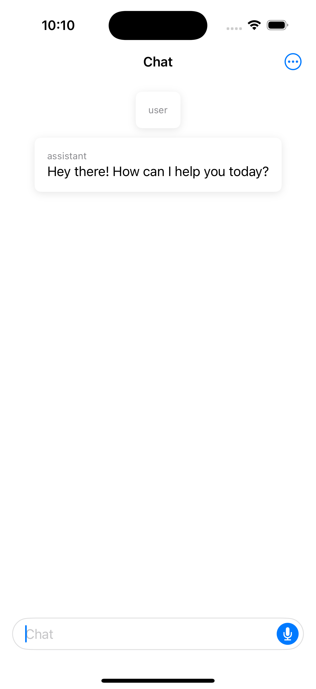
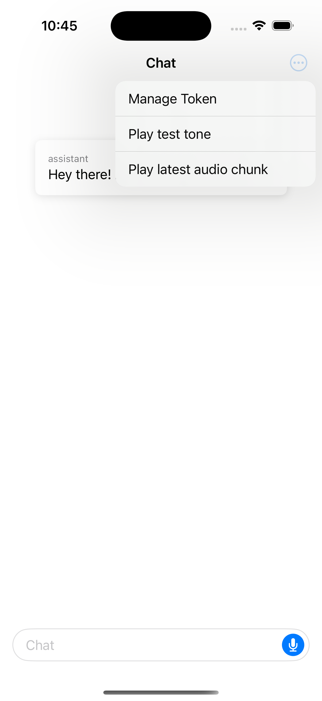

# Cue

AI-Powered Personal Assistant for iOS (Demo Project)

## Getting Started

### Prerequisites

- iOS 17.0 or later
- An API key from OpenAI
- **Note**: As this is a demo and experimental project, some features may be limited or subject to change.

### Setup API key

Make a copy of debug configuration file:

```sh
cp Cue/Debug-Example.xcconfig Cue/Debug.xcconfig
```

Update the API key accordingly.

## Features

- Real-time AI voice interaction ([OpenAI Realtime API](https://platform.openai.com/docs/guides/realtime))

## Screenshots

<p float="left">
  
  
</p>
