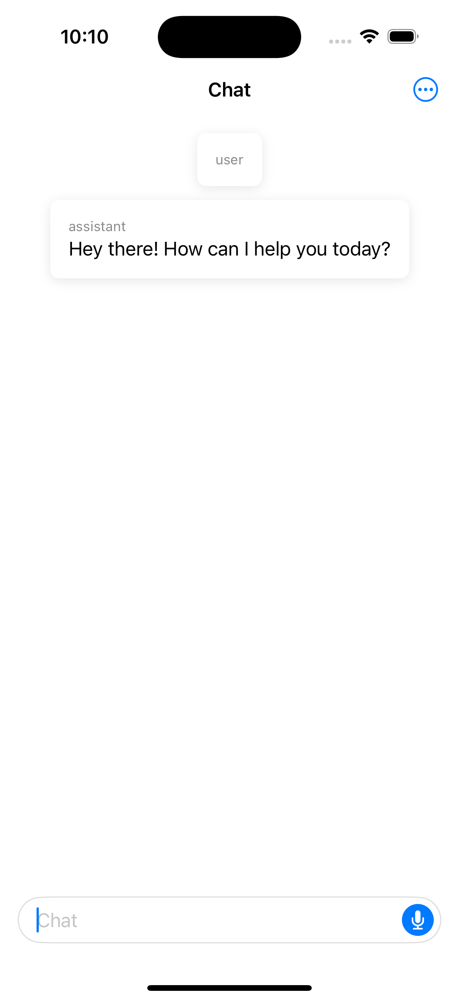
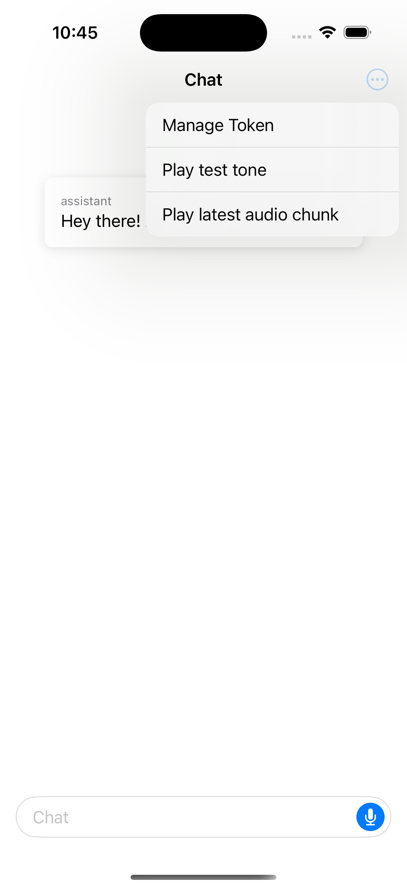

# Cue

An AI-powered customizable personal assistant framework for iOS and macOS that lets you create and interact with your personalized AI agent across all your Apple devices.

## Features

- **Cross-Platform Support**: Seamlessly access your AI assistant on both iOS and macOS
- **Real-Time Interactions**:
  - WebSocket support for live agent updates
  - OpenAI real-time voice interaction using the [OpenAI Realtime API](https://platform.openai.com/docs/guides/realtime) (in development)
- **Advanced Integration**:
  - Implementation of [Model Context Protocol](https://github.com/modelcontextprotocol)
  - OpenAI Chat integration
  - Multi-LLM provider support (coming soon)
- **User Management**:
  - Secure authentication (sign up/sign in)
  - Comprehensive agent management system
- **Productivity Tools**:
  - Desktop screenshot capture
  - Integration with all tools available via [Model Context Protocol](https://github.com/modelcontextprotocol)
  - More tools coming soon!

## Prerequisites

- iOS 17.0 or later
- OpenAI API key
- macOS (for desktop features)

**Note**: This project is currently in experimental phase; features may be subject to changes or limitations.

## Installation & Setup

### Setting Up API Key

#### For Users

Configure your OpenAI API key through the settings page in the app.

#### For Developers

1. Create your local debug configuration:

```sh
cp Cue/Debug-Example.xcconfig Cue/Debug.xcconfig
```

2. Add your OpenAI API key to the newly created `Debug.xcconfig` file.

## Screenshots

<p float="left">
  
  
</p>

## Development Roadmap

- Integration of additional LLM providers
- Enhanced tool ecosystem
- Advanced customization options

## Contributing

We welcome contributions! Please feel free to submit pull requests or open issues for any bugs or feature requests.
