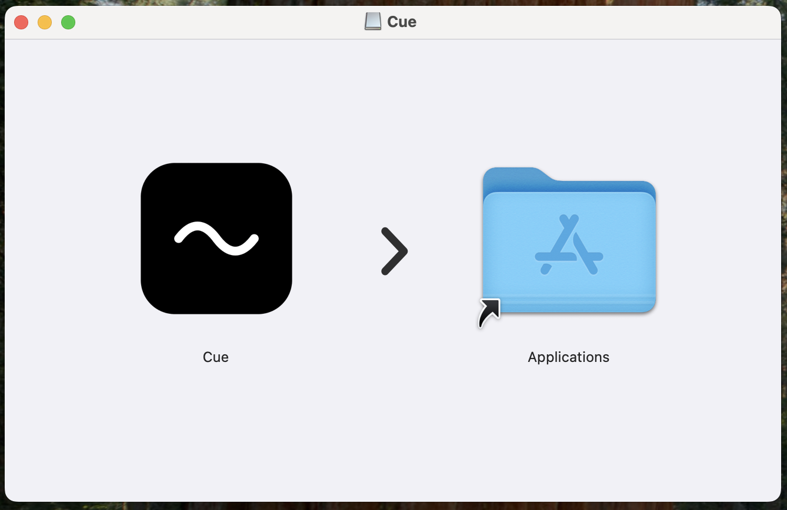
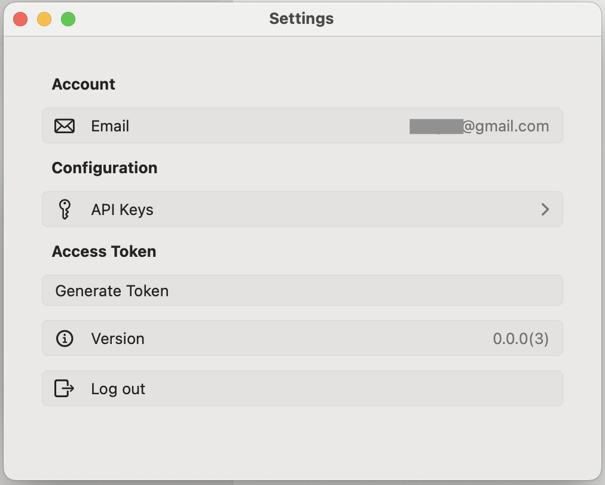
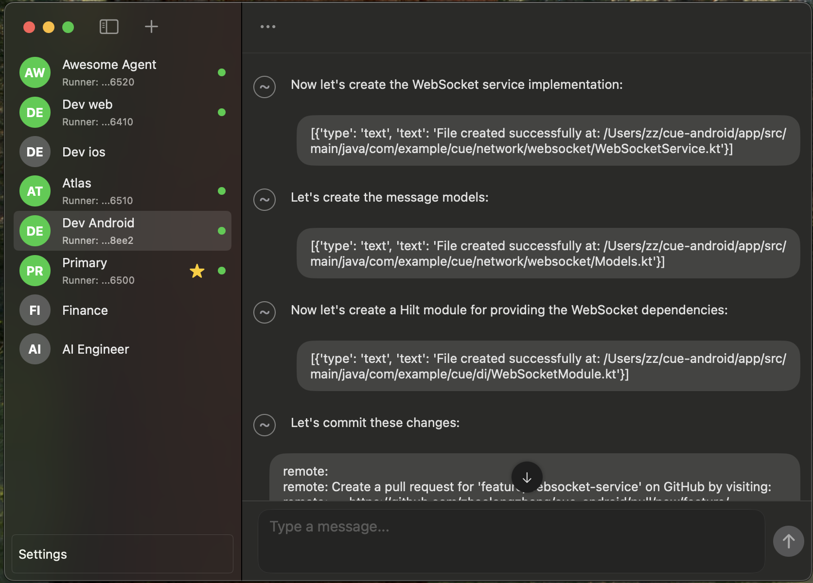
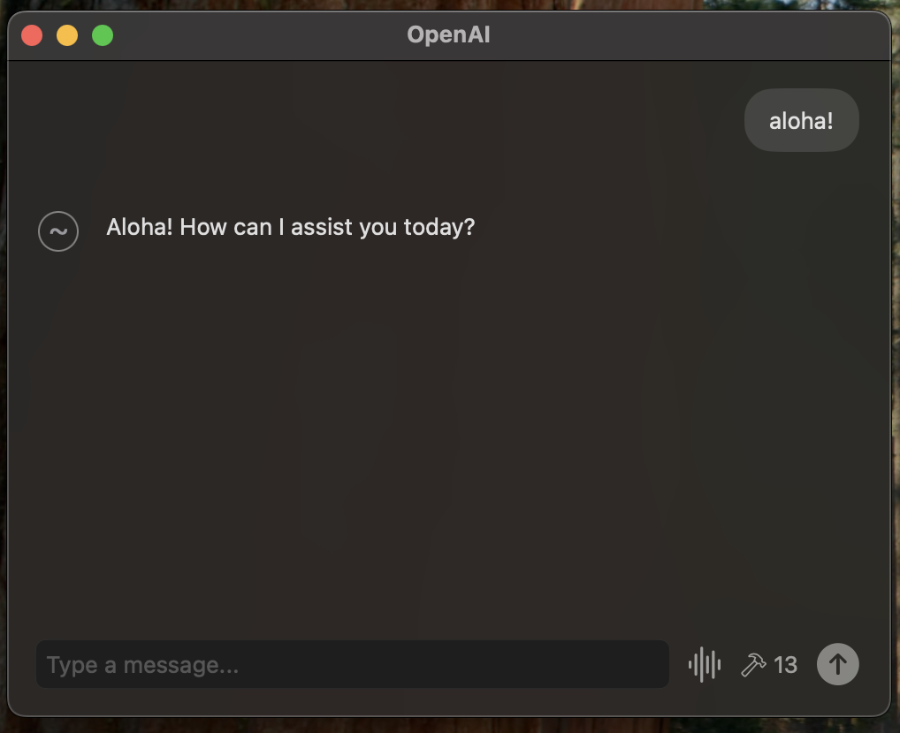
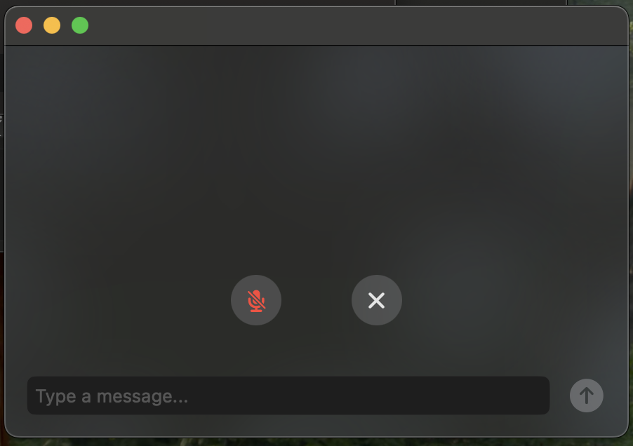
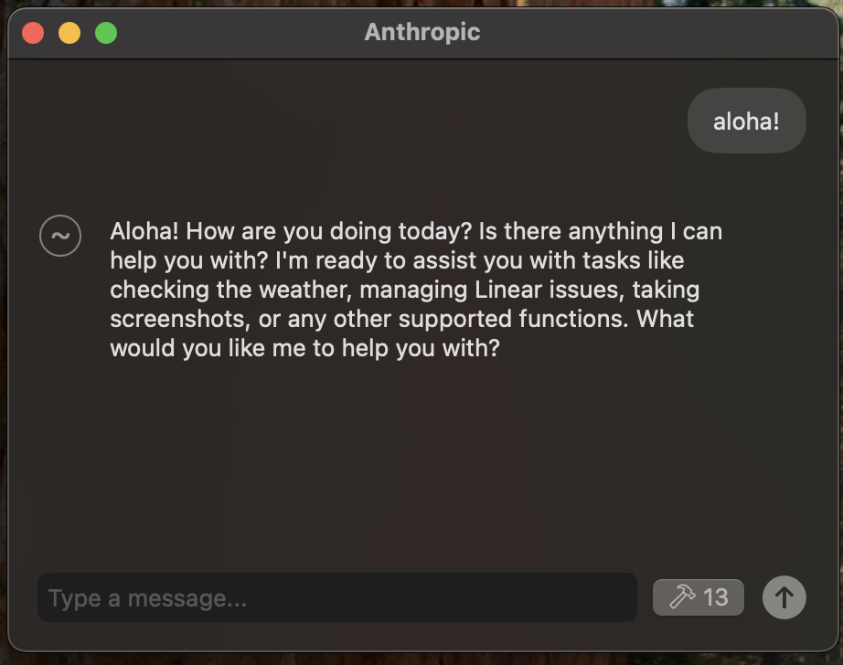

# Cue

An AI-powered customizable personal assistant for iOS and macOS that lets you create and interact with your personalized AI agent across all your devices or server, locally and remotely.

## Features

- **Agent management**:

  - Create multiple agents and have them run and work simultaneously
  - Live communication with your agents through WebSocket no matter where you deploy it, so you can collaborate with your agent on a project or delegate tasks.
  - Configure agent run details for your personal needs
  - Currently, this feature needs configure your local agent by following [this guide](https://plusonelabs.ai/get-started).

- **Simple chat**

  - Simple chat with provider like OpenAI and Anthropic
  - Configureable tool use by using MCP

- **Realtime Interactions**:

  - Support OpenAI realtime voice interaction using the [OpenAI Realtime API](https://platform.openai.com/docs/guides/realtime)
    - using WebSocket and WebRTC
  - Tool use support with voice

- **Advanced Integration**:

  - Support [Model Context Protocol](https://github.com/modelcontextprotocol) supports both OpenAI and Anthropic models

- **Cross-Platform Support**: You can use both iOS and macOS to access your AI agents at anywhere and anytime.

## Install

### Mac app

- Download the assets zip file that contains DMG file under [release page](https://github.com/zhaolongzhong/cue-ios/releases)
- Unzip and click DMG file, drag to application folder

  

For simple chat with like OpenAI and Anthropic, you need to configure correspoinding api key to enable options and those screen in settings page.

  

### iOS

It's currently available in TestFlight. Please reach out [here](https://plusonelabs.ai/request-demo) for an invite.

## Build macOS app

If you want to build the app locally by yourself, great!

## Prerequisites

- iOS 17.0 or later
- OpenAI or Anthropic key
- macOS (for desktop features)

## Screenshots

  

  
  

  

## Technical features

- User authentication: login, sign up
- Infinite message list
- Reatl-time chat feature (WebSocket and webRTC support)
- Online and offline status update (WebSocket)
- Local perisistence with [GRDB](https://github.com/groue/GRDB.swift)
- MVVM repositry pattern: use repository as source of truth of data handling
- Dependency injection with [Dependencies](https://github.com/pointfreeco/swift-dependencies)
- Modularation: multiple package design, e.g. CueApp, CueOpenAI

## Diagram architecture

- TODO: add feature diagram
- TODO: add architecture details, service, repository and view model
- TODO: add websocket communication

## CueOpenAI

This package is essentially a Swift SDK for OpenAI chat and realtime API service. For integrating those services, it probably can save few days work by use the package and or simply reeferencing it.

You can check its [README](CueOpenAI/README.md)

## Development Roadmap

- Gemini live service support

## Contributing

We welcome contributions! Please feel free to submit pull requests or open issues for any bugs or feature requests.
