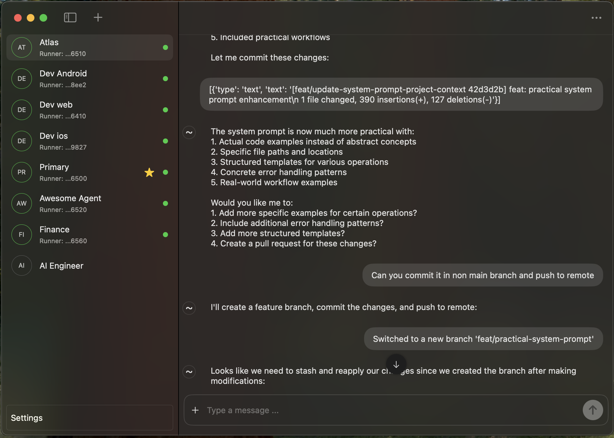

# Cue

An AI-powered, customizable personal assistant for iOS and macOS that allows you to create and interact with personalized AI agents across devices or servers, both locally and remotely.

## Features

- **Authentication Management**: Seamlessly sign up and log in.
- **Multi-Agent Support**: Create multiple agents and run them simultaneously to handle different tasks.
- **Live Communication**: Maintain real-time interaction with your agents through WebSocket, enabling collaborative project work and task delegation.
- **Flexible Configuration**: Customize agent runtime settings and tools to fit your personal use cases.
  - **Note**: Local agent configuration currently requires manual setup. Follow [this guide](https://plusonelabs.ai/get-started) for instructions.
- **Integrated Chat**: Simple chat functionality with providers like OpenAI and Anthropic.
- **Configurable Tools**: Leverage [Model Context Protocol](https://github.com/modelcontextprotocol) to support both OpenAI and Anthropic models.
- **Realtime Voice Chat**: Utilize OpenAI's [Realtime API](https://platform.openai.com/docs/guides/realtime) for voice-enabled interactions with agent tools.
- **API Key Management**: Easily manage and configure API keys for different services.

### Mac App

1. Download the assets zip file containing the DMG file from the [release page](https://github.com/zhaolongzhong/cue-ios/releases).
2. Unzip and open the DMG file, then drag the app into the Applications folder.

  

For chats with OpenAI or Anthropic, configure the corresponding API keys in the settings page to enable related features.

### iOS

Currently available on TestFlight. Request an invite [here](https://plusonelabs.ai/request-demo).

## Screenshots

### iOS

**Authentication**

  
  

**Assistants List & Chat**

  
  
   
  

**Realtime Voice Chat**

  
  

**Settings**

  
  

### Mac

**Authentication**

  
  

**Assistants List & Chat**

  
  

**Realtime Voice Chat**

  

**Model Set Context (MCP)**

  

**Settings**

  

## Technical Features

- **User Authentication**: Supports sign-up and login.
- **WebSocket Communication**: Enables live message updates and assistant status monitoring.
- **Voice Tool Support**: Seamlessly integrates voice-enabled tools.
- **Realtime Voice Chat**: Uses WebSocket and WebRTC technologies for interactive communication.
- **MVVM Architecture**: Employs the repository pattern as the data handling source of truth.
- **Modular Design**: Built with multiple packages (e.g., CueApp, CueOpenAI) for scalability.
- **Reusable Components**: Includes shared elements like themes and reusable views.
- **Minimal External Dependencies**:
  - Dependency injection via [Dependencies](https://github.com/pointfreeco/swift-dependencies).
  - Local data persistence using [GRDB](https://github.com/groue/GRDB.swift).
- **Modern Design**: Adopts visual effects and supports both light and dark themes.

## Architecture

## CueOpenAI

This package is essentially a Swift SDK for OpenAI chat and realtime API service. For integrating those services, it probably can save few days work by use the package and or simply reeferencing it.

You can check its [README](CueOpenAI/README.md)

## Development Roadmap

- Gemini live service support

## Contributing

We welcome contributions! Please feel free to submit pull requests or open issues for any bugs or feature requests.
